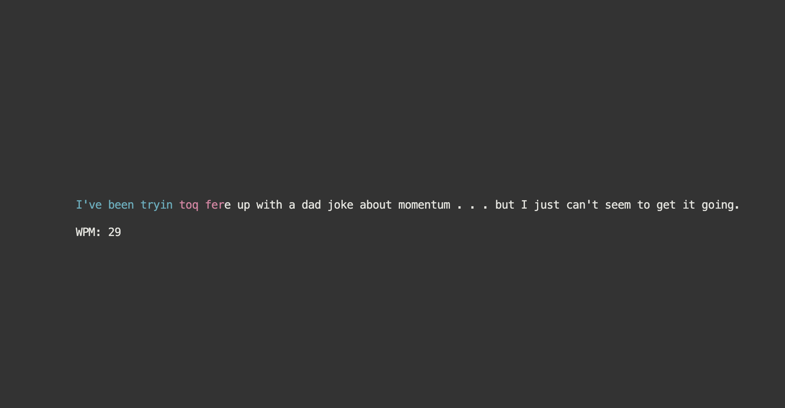

# Speed Typing Game (beta version, still in development)
Check out your typing speed with this terminal based game developed using Python's Curses Module!

## How it works
Make sure you have Python's curses module installed on your PC or Laptop.
Run the program and select "Play typing Game" and you're all set!

## Features
- Phrase generator: uses Python's requuest module to pull jokes from an online website to generate unique phrases each time.

- Dad Jokes: if you're just in the mood to laugh, the program can fetch a joke for you from an online source.

- Colorful typing: Whenever you make a mistake, the text becomes red and otherwise becomes blue.

- Words per minute: Using a simple formula, you can see how many words per minute you can type.

## How the app looks

